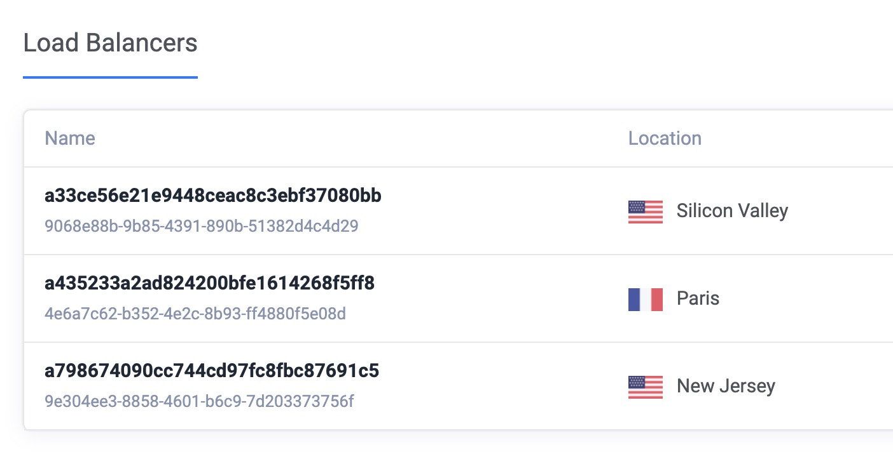
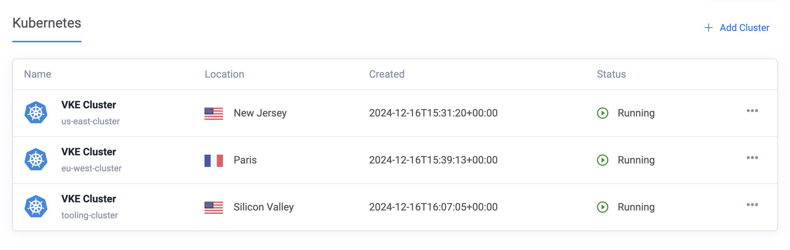
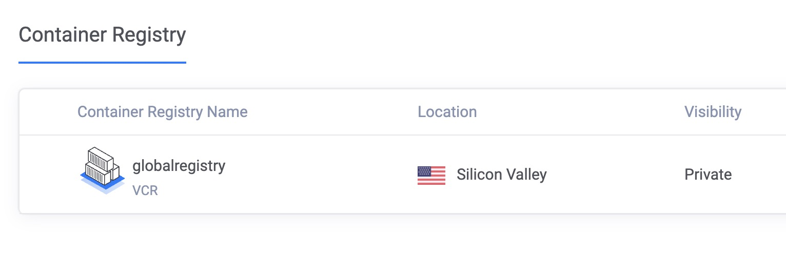

# Description

## Problem Analysis

The scenario is as follows:

- A Kubernetes cluster running on Vultr, using Traefik as the Ingress Controller.
- In the Vultr environment, three Kubernetes clusters are deployed: tooling, us-east, and eu-west. The setup includes a LoadBalancer for traffic distribution and a Container Registry for managing and storing container images.
- Cert-manager is used with Let’s Encrypt to obtain TLS certificates.
- The Ingress is configured to use TLS (via Traefik Annotations and a ClusterIssuer from cert-manager).
- The application (`foobar-api`) runs with its own internal TLS, as shown in `app.go` where it calls `server.ListenAndServeTLS("/cert/cert.pem", "/cert/key.pem")`.
- Traefik was configured for TLS Passthrough. This means Traefik will not terminate the TLS connection, only forward the encrypted traffic directly to the backend.
- ArgoCD and GitHub Actions for GitOps, simplifie application deployment and management.
- Kustomize to simplify the management of Kubernetes manifests by enabling environment-specific customizations (e.g., eu-west and us-east)

---

## Using nip.io for DNS

The public DNS service nip.io was used to avoid managing a custom DNS. It enables the creation of subdomains that automatically resolve to a specified IP based on the hostname.

If the LoadBalancer IP is 144.202.101.170, hostnames can be created like:

- `prometheus.144.202.101.170.nip.io`
- `grafana.144.202.101.170.nip.io`
- `argocd.144.202.101.170.nip.io`
- `paris-cluster.95.179.208.170.nip.io`
- `newyork-cluster.45.77.154.12.nip.io`

---

### Requirements

- The certificate must be automatically issued by cert-manager (Let's Encrypt).
- The certificate must be mounted into the Pod.
- The Go application must serve HTTPS (TLS) internally, using the mounted certificate.

---

### Final Flow

- User → HTTPS → Traefik (no TLS termination, just passthrough) → Pod with internal TLS → HTTPS response from the backend.
- The Let’s Encrypt certificate is initially generated as a Secret by cert-manager.
- This certificate is copied via volume mounts.
- The main Pod mounts the volume and reads `cert.pem` and `key.pem`.
- The Ingress does TLS passthrough.

---

### foobar-api

Tiny Go webserver that prints os information and HTTP request to output

### How to Secure a VKE Cluster Using Traefik, Cert-Manager, and Let's Encrypt

This guide provides a step-by-step approach to securing a Vultr Kubernetes Engine (VKE) cluster using Traefik, Cert-Manager, and Let's Encrypt for TLS management. It also includes details about setting up monitoring with Prometheus and integrating ArgoCD for GitOps.

---

### Documentation References

- [Vultr VKE Security Guide](https://docs.vultr.com/how-to-secure-a-vke-cluster-using-traefik-certmanager-and-lets-encrypt)
- [Cert-Manager Documentation](https://cert-manager.io/docs/installation/helm/)
- [Traefik Installation Guide](https://doc.traefik.io/traefik/getting-started/install-traefik/)
- [ArgoCD Ingress Configuration](https://argo-cd.readthedocs.io/en/release-2.2/operator-manual/ingress/#traefik-v22)
- [New Relic Prometheus Agent](https://docs.newrelic.com/docs/infrastructure/prometheus-integrations/install-configure-prometheus-agent/setup-prometheus-agent/)
- [ArgoCD GitHub Issues](https://github.com/argoproj/argo-cd/issues/9422)

### Architecture Overview

Below are visual representations of the architecture components used in this project:

### Load Balancer

### Kubernetes Clusters

The project consists of three clusters: `tooling`, `us-east`, and `eu-west`, each serving specific regions and purposes.

### Container Registry

